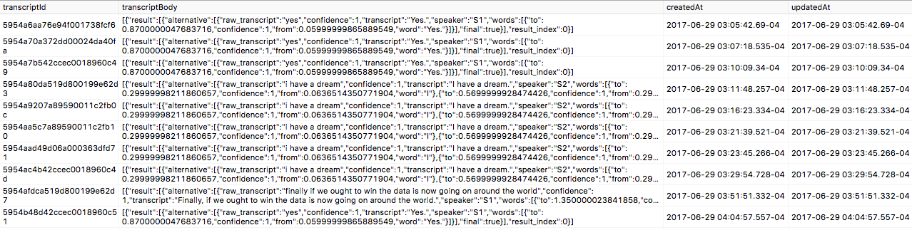
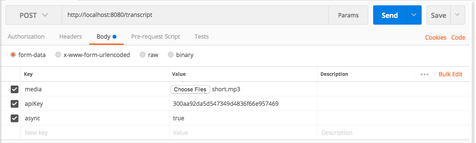
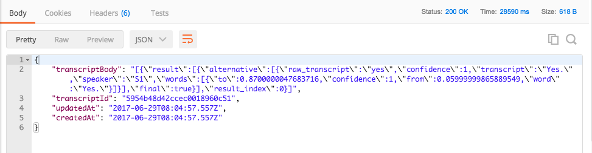

[](https://waffle.io/zcaceres/capio-api?utm_source=badge)
# Easy Transcription with Capio's Speech Recognition API
> Zach Caceres

## Overview
This program provides a simple RESTful API (/transcript) to create and retrieve transcripts of audio files using the Capio.ai Speech Recognition API.

* Audio files are sent to the server and forwarded to Capio
* Server polls Capio until transcription is complete
* Transcripts are saved in a PostgreSQL database by transcriptId (assigned by Capio)
* You can access any transcription by transcript-id after it's processed by Capio

### Stack
Built with *NodeJS* and:
- *Express* for routing
- *PostgreSQL/pg/Sequelize* for DB/persisting transcriptions
- *Supertest/Mocha* for testing

## How To Use
You'll need [PostgreSQL](https://www.postgresql.org/download/) installed. On OSX, I prefer the minimalist [Postgresapp](https://postgresapp.com/) and [Postico](https://eggerapps.at/postico/)

1. By default, this program looks for a database named 'capio-api'. You can either make an empty one with this name, or change the database name in CONFIG.js. 
2. ```npm install``` dependencies using package.json
3. Add your PostGres username and password to the CONFIG.js file
4. Add your API key to the CONFIG.js file
5. You may need to set FORCE_DB_SYNC to true during your first run
6. ```npm start``` will launch your server

**To Create a Transcription:**

Send a POST request with an audio file to: http://localhost:8080/transcript

Your POST request needs the following parameters:
```js
{
  media: 'your_file_here',
  apiKey: 'your_api_key_here',
  async: true
}
```
A successful POST request will populate your database with JSON transcripts stored by transcriptIds. Here's how that looks in Postico:


**To Retrieve a Transcription:**

Send a GET request to /transcript with the transcription ID: http://localhost:8080/transcript/:transcriptionId

## Easy Testing with [Postman](https://www.getpostman.com/apps)
This repo includes four sample audio files and an incorrect file for easy testing. They are labeled according to the length of the audio.

* medium.wav
* short.mp3
* long.mp3
* invalid-mimetype.jpg

For easy testing, consider using Postman like the following example:


You should receive a response like this:


## Unit Tests
To run tests, ```npm test``` from the directory that contains package.json

## Linter/Style
Written with ESLint and a no semi-colon extension of [this config](https://www.npmjs.com/package/eslint-config-fullstack)

## Challenges and Opportunities for Improvement
I've left *TODOs* throughout the codebase to show things that I could have done better and opportunities to improve this code in  the future.

Here are a few:

*Testing:*
- Finish the test suite with enough time to do complete coverage. Specifically, I must test Sequelize models more closely and check responses in detail from Capio and PostGres not just their status code.
- Testing revealed a design flaw in how I handled the response from Capio. I should have sent the user some indication that the request was still processing. Then, after the transcript came back, I could send them the text.
- capioManager and validation needs testing

*Validation and Cleanup:*
- Validation uses a hacky approach to ensure only audio files are sent to the server. Should check encoding rather than content header.
- No file cleanup is done after audio upload. This is not scalable at all.

*Error Handling:*
- There are many edge cases and potential areas for error that are not yet well-handled
- In the event of an error or timeout while pinging Capio api, this program should retry the transcription several times before moving on
- Users could send binary files using x-www-form-urlencoded. These are not handled at all but could make it easier for developers to ping the API without encoding as multipart form data

*Other:*
- Transcript seems to occasionally cut off first or last words in each 'result' block. I'm not yet sure why.
- The 'long.mp3' media sample has never successfully returned a transcript. I dont yet know why.
- Refactoring to promisify response logic after POST request. Currently, the Express response is passed down through too many files and functions. This makes the flow hard to understand.
